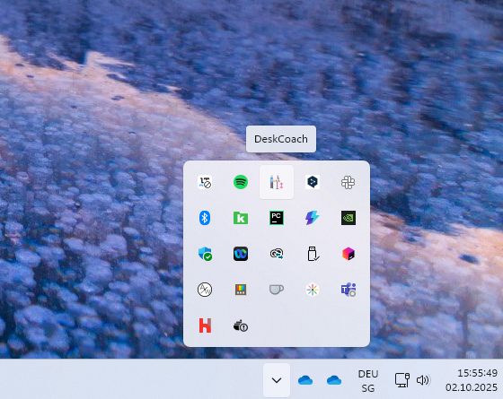
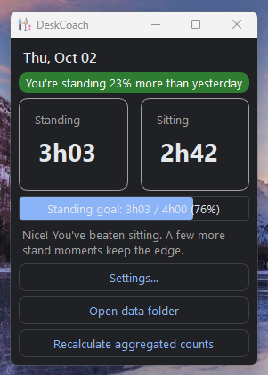
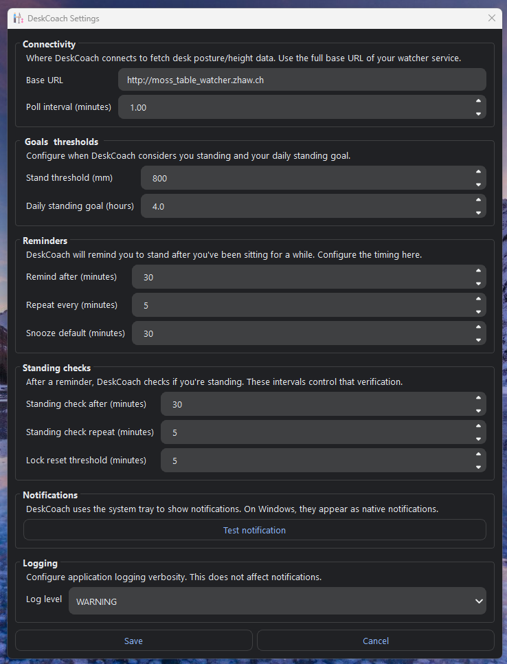
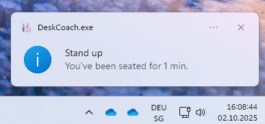
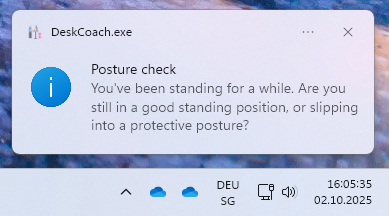

# DeskCoach

A minimal PyQt6 system tray app for Windows that reminds you to take healthy breaks.

- Lightweight and privacy‑friendly: all data stays local
- Native Windows Toast notifications with optional sound
- Quick access from the system tray (pause, snooze, settings)

## Screenshots

A quick visual tour of DeskCoach.

### Tray icon
<p align="center">
  
</p>

### Main window
<p align="center">
  
</p>

### Settings
<p align="center">
  
</p>

### Reminder toast
<p align="center">
  
</p>

### Posture check
<p align="center">
  
</p>

All images include descriptive alt text for screen readers.

## Quick start

- Requirements: Windows 10/11, Python 3.10+
- Install dependencies (PowerShell):

```powershell
python -m venv .venv
.\.venv\Scripts\Activate.ps1
python -m pip install -r requirements.txt
```

- Run the app:

```powershell
python -m deskcoach.main
```

Or, after installing as a package (build or editable install), use the console script:

```powershell
deskcoach
```

The app places an icon in the system tray. Right‑click for the menu (Open, Settings, Pause/Resume, Snooze, Exit).

## Project layout

- src\deskcoach\main.py — entry point
- src\deskcoach\views — simple windows/dialogs
- src\deskcoach\services — notifier, scheduler, reminders, session watcher
- src\deskcoach\models — lightweight SQLite-backed store
- src\deskcoach\resources\icons — app icons

## Tests

Run the test suite from the project root:

```powershell
pytest -q
```

## Notifications settings

- Use Windows Toast notifications: When enabled on Windows 10/11 and the WinRT runtime is available, DeskCoach will use system Toast notifications for reminders. If Toast is unavailable (e.g., missing runtime), the app falls back to a tray balloon message.
- Play sound in notifications: Adds the system notification sound to Windows Toasts. This has no effect on the tray fallback, which is always silent by design.

Tip: Open Settings and click "Test notification" to preview how notifications look with your current settings.

## Build (optional)

You can create a Windows executable with PyInstaller. A starter spec file is provided:

```powershell
pyinstaller main.spec
```

This will produce dist\DeskCoach.exe.
